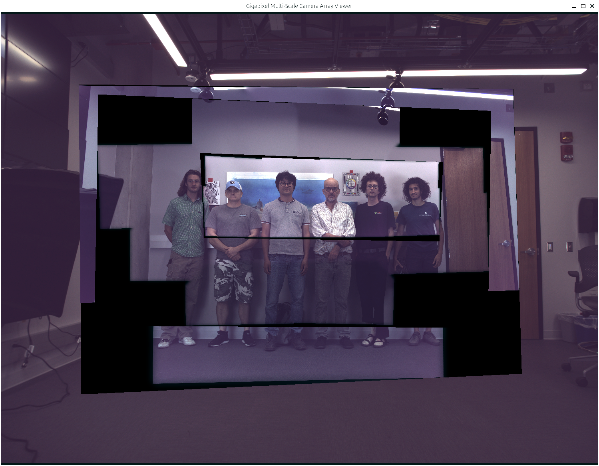

# Heterogeneous Camera Array - Multiscale Viewer

Viewer application for multiscale imagery captured with multi-focal camera arrays (4mm, 8mm, 21mm, 35mm) and polarization sensors.



## Versions & Downloads

| Version | Operating System | Features | Branch Link |
| :--- | :--- | :--- | :--- |
| **Multiscale Viewer 2** | Windows x64 | Polarization support (DoLP, AoLP, S0, I0-I135), auto deep-zoom, sample datasets | [View `windows-v2-pol`](https://github.com/arizonaCameraLab/Heterogeneous-Camera-Array/tree/windows-v2-pol) |
| **Multiscale Viewer 1** | Windows x64 | Standard multiscale viewer (4mm, 8mm, 21mm, 35mm) + homography generator | [View `windows-v1`](https://github.com/arizonaCameraLab/Heterogeneous-Camera-Array/tree/windows-v1) |
| **Multiscale Viewer 1** | Linux x86_64 | Standard multiscale viewer with bundled dynamic libraries | [View `linux-v1`](https://github.com/arizonaCameraLab/Heterogeneous-Camera-Array/tree/linux-v1) |

## Cloning a Branch

To clone only the branch you need:

```bash
# Windows Viewer 2 (with polarization)
git clone -b windows-v2-pol https://github.com/arizonaCameraLab/Heterogeneous-Camera-Array.git

# Windows Viewer 1
git clone -b windows-v1 https://github.com/arizonaCameraLab/Heterogeneous-Camera-Array.git

# Linux Viewer 1
git clone -b linux-v1 https://github.com/arizonaCameraLab/Heterogeneous-Camera-Array.git
```

## Running the Viewer

### Windows (v1 & v2)
1. Switch to or clone the relevant Windows branch (`windows-v2-pol` or `windows-v1`).
2. If needed, install the Visual C++ runtime (`vc_redist.x64.exe`).
3. Run `viewer.exe` (Viewer 2) or `MultiscaleViewer.exe` (Viewer 1).

### Linux (v1)
1. Switch to or clone the `linux-v1` branch.
2. In your terminal, run:
```bash
chmod +x run_viewer.sh viewer
./run_viewer.sh
```

## Controls

### Mouse Controls
- Mouse Wheel: Zoom In / Zoom Out
- Left Click + Drag: Pan across image

### Layer Selection
- 0: Auto Deep-Zoom Mode (automatically swaps layers based on zoom level)
- 1: Force 4mm Base Layer
- 2: Force 8mm RGB Stitched Layer
- 3: Force 8mm Polarization Layer (Viewer 2 only)
- 4: Force 21mm Stitched Layer
- 5: Force 35mm Stitched Layer

### Polarization Modes (Viewer 2 only, when 8mm layer is active)
- Q: S0 (Total Intensity)
- W: I0 (0-degree)
- E: I45 (45-degree)
- R: I90 (90-degree)
- T: I135 (135-degree)
- Y: DoLP (Degree of Linear Polarization - Viridis colorbar)
- U: AoLP (Angle of Linear Polarization - HSV colorbar)

### Viewport Controls
- Spacebar: Reset View (recenter and default zoom)

---

## Camera Array Processing Examples

This repository also includes reproducible processing examples for the accompanying IEEE Transactions on Computational Imaging manuscript. The notebook covers cross-camera registration, image fusion, polarization overlays, focus/exposure stacking, and local refinement for synchronized captures.

### Processing quick start

1. Clone the repository and enter its root directory.
2. Create and activate a Python environment.
3. Install the dependencies:

   ```bash
   pip install -r requirements.txt
   ```

   The validated environment uses Python 3.10. Conda users can reproduce it with `conda env create -f environment.yml`.

4. Start Jupyter from the repository root and open `Camera_Array_Processing_Examples.ipynb`.

   ```bash
   jupyter lab
   ```

The notebook automatically selects CUDA when available and otherwise uses the CPU. If Jupyter must be started from another directory, set `CAMERA_ARRAY_PROJECT_ROOT` to the cloned repository path before launching it.
